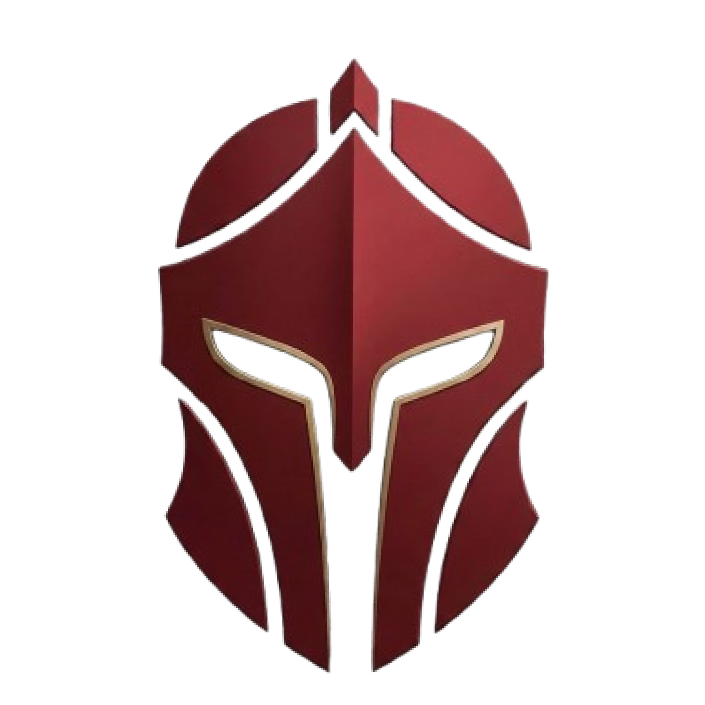

<div align="center">



# IGRIS

**The knight that protects your servers.**
An **Observability and AIOps platform** designed to detect anomalies and predict infrastructure failures before users even notice them.

[](LICENSE)


</div>

---

# Overview

Modern applications generate massive volumes of logs and operational events.
When something breaks, engineering teams often spend **hours investigating logs and metrics** to identify the root cause.

**Igris** is an observability and AIOps platform designed to **proactively detect anomalies in system behavior** by analyzing real-time log streams using Machine Learning models.

Instead of reacting to failures, **Igris predicts them**.

The platform continuously monitors infrastructure signals and alerts engineers when abnormal patterns appear — often **before a failure impacts users**.

---

# Key Features

### Real-time Log Ingestion

High-throughput ingestion pipeline designed to process large volumes of system and application logs.

### AI-powered Anomaly Detection

Machine Learning models such as **Isolation Forests** and **Autoencoders** detect subtle behavioral anomalies in infrastructure data.

### Proactive Alerting

Receive alerts via push notifications, dashboards, or webhooks before failures escalate.

### Unified Observability Dashboard

A centralized interface to visualize logs, anomalies, alerts, and infrastructure health.

---

# System Architecture

Igris follows an **event-driven architecture** where logs are ingested, processed, analyzed by ML models, and then transformed into actionable insights.

```
Servers / Applications
        │
        ▼
Log Ingestion API (Fastify)
        │
        ▼
Event Stream Processing
        │
        ▼
ML Engine (Python)
        │
        ▼
Anomaly Detection
        │
        ▼
Alerts + Dashboard
```

The platform separates responsibilities into independent services to ensure scalability and flexibility.

---

# Monorepo Architecture

This project is structured as a **monorepo** to facilitate collaboration, code sharing, and scalability across services.

## Project Structure

```
igris-platform
│
├── apps
│   ├── api        # Log ingestion service (Node.js + Fastify)
│   ├── web        # Observability dashboard (React)
│   └── mobile     # Mobile alerting app (React Native)
│
├── services
│   └── ml-engine  # Machine learning worker (Python)
│
├── packages
│   ├── core       # Shared business logic
│   ├── types      # Global TypeScript types
│   ├── database   # Database schema and ORM configuration
│   └── configs    # Shared linting and tooling configs
│
└── docs
    ├── adr        # Architectural Decision Records
    └── architecture
```

Shared packages allow all services to reuse types, schemas, and core logic while maintaining service independence.

---

# Tech Stack

## Backend

* Node.js
* Fastify
* TypeScript

## Frontend & Mobile

* React
* React Native

## Machine Learning

* Python
* Isolation Forest
* Autoencoders

## Database & Data Layer

* Drizzle ORM

## Architecture

* Event-driven architecture
* Microservices
* Monorepo with shared packages

---

# Project Status

**Igris is currently in early MVP development.**

Initial work is focused on building the core infrastructure:

* Log ingestion pipeline
* Event processing architecture
* Machine learning anomaly detection
* Observability dashboard

Documentation and setup instructions will evolve as the project matures.

---

# Roadmap

### Phase 1 — MVP

* Log ingestion API
* Basic anomaly detection
* Initial dashboard
* Alert system

### Phase 2 — Observability Platform

* Advanced anomaly detection models
* Infrastructure metrics integration
* Alert routing
* Historical anomaly analysis

### Phase 3 — AIOps Platform

* Predictive infrastructure analytics
* Automated incident detection
* AI-assisted root cause analysis
* Automated remediation workflows

---

# Vision

The long-term vision of **Igris** is to evolve into a **fully autonomous AIOps platform** capable of:

* Predicting infrastructure failures before they happen
* Automatically detecting incidents
* Assisting engineers in root cause analysis
* Providing intelligent remediation suggestions

Ultimately, Igris aims to reduce operational complexity and empower teams to focus on building reliable systems.

---

# 🚀 Getting Started

Setup instructions will be added as the MVP progresses.

### Prerequisites

* Node.js (v18+)
* Python (3.9+)
* Package manager (pnpm, npm, or yarn)

---

# Contributing

Contributions are welcome!

As the project evolves, a detailed **CONTRIBUTING.md** guide will be provided.

For now:

1. Open an issue describing your idea
2. Discuss architecture or improvements
3. Submit a pull request

---

# 📄 License

This project is licensed under the **Apache 2.0 License**.

See the [LICENSE](LICENSE) file for more information.
